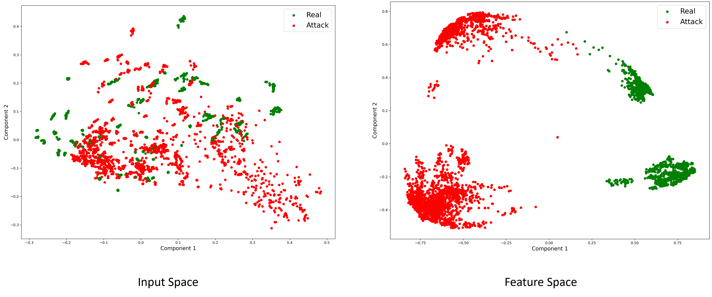

# Face Presentation Attack Detection using Transfer Learning and Image Diffusion
Using image diffusion and transfer learning for face presentation attack detection.

## Model Description
Uses a pre-trained MobileNet model in a fine-tuning setting. Video frames are captured and diffused.

## Code Description
### Data Loading
Three functions are defined for loading data
* read_all_frames(datapath): reads and returns all frames of a video clip, frame dimensions is chosen (224, 224) for CASIA-FASD database (The image diffusion takes place here)
* my_frames(datapath, N): takes the path of a directory of one class and reads the frames of all videos in the directory, randomly selects N frames from each video and returns a numpy array of frames
* load_all_data(): takes the required number of frames (N) and datapath of all the classes of train, validation, and test data and returns training, validation, and test data and labels
### Model Definition
MobileNet with ImageNet weights is loaded as the base model followed by two fully-connected layers with 512 and 1 nodes respectively.
### Model Training
The model is trained for 50 epochs, batch size of 64, and an early stopping pateince of 10 epochs. The model checkpoints are saved as h5 files in a directory.
### Inference Phase
A function is defined to calculate the confusion matrix parameters and these parameters are used to calculate the performance evaluation matrics such as accuracy, HTER, EER, sensitivity, etc.

## Comparison of Diffusion on Input Data
The image diffusion mechanism in this work is compared with the state-of-the-art Perona-Malik Anisotropic diffusion. The PCA embeddings of both the diffusion techniques is shown in the following diagram.

## Input Space Vs. Latent Feature Space

