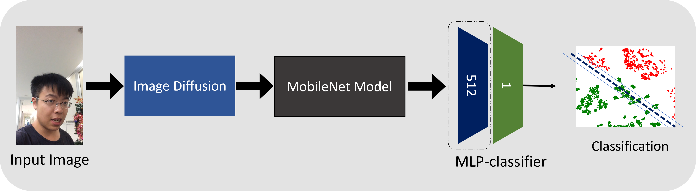
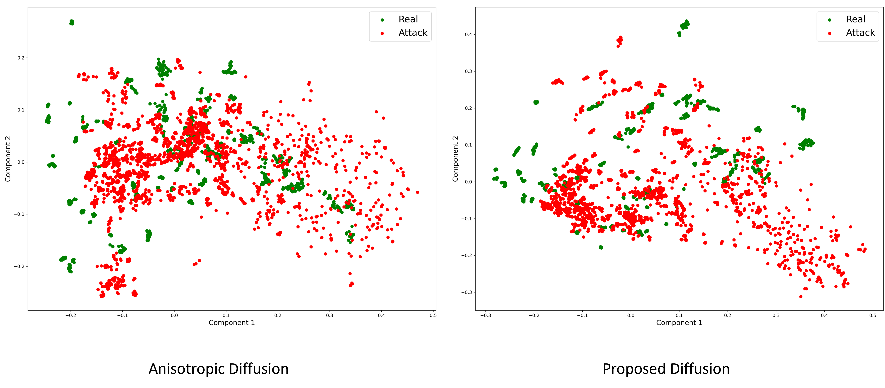

# Face Presentation Attack Detection using Image Diffusion
Using image diffusion and transfer learning for face presentation attack detection.

## Model Description
Uses a pre-trained MobileNet model in a fine-tuning setting. Video frames are captured and diffused.

## Comparison of Diffusion on Input Data
The image diffusion mechanism in this work is compared with the state-of-the-art Perona-Malik Anisotropic diffusion. The PCA embeddings of both the diffusion techniques is shown in the following diagram.

